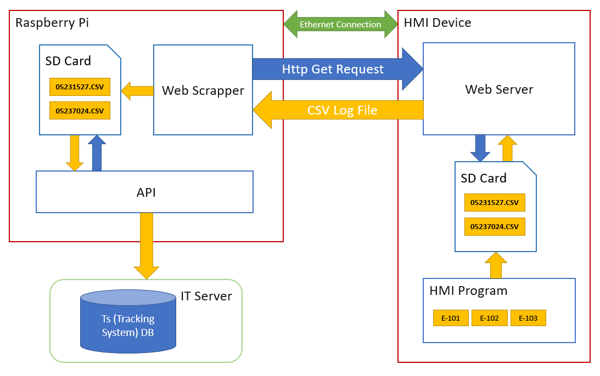

# HMI-Web-Scrapper

Python Web Scrapper that runs on rapsberry pi 4 model B at startup. Scraps the csv logs generated by a red lion HMI web server
and then inserts each row of the generad csv log into a private SQL Database

## Table of Contents

1. [Schema](#schema)
2. [Glossary](#glossary)

## Schema

## Glossary

| Term | Definition |
| --- | --- |
| HMI | Human Machine Interface: A user interface or dashboard that connects a person to a machine, system, or device. |
| Raspberry Pi | A small, affordable computer popular for learning programming and for projects in IoT, automation, and more. |
| Ftp | File Transfer Protocol, is a protocol used for transferring files over the internet |
| Ftp Server | server is a system that accepts and processes FTP requests from FTP clients. |
| Ftp Client | is software that initiates FTP file transfers by connecting to an FTP server. |
| SD Card | Secure Digital Card: A portable storage device used in many types of electronic devices for expanded memory capabilities. |
| Ethernet | A common method for connecting computers in a local area network (LAN) using physical wired connections. |
| CSV | Comma Separated Values: A simple file format used to store tabular data, such as a spreadsheet or database. |
| API | Application Programming Interface: A set of rules and protocols for building and interacting with software applications. |
| E-N | Estandar-Number: Test Specificacion for certain piece of hardware to be tested |

